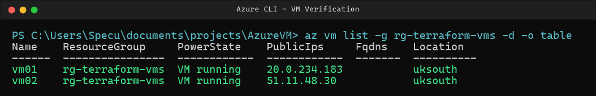

# Terraform Azure VM Provisioner


## At a Glance

I used Terraform to build a small, secure Linux environment on Microsoft Azure entirely from code: two Ubuntu servers, their network, and a firewall. Nothing was clicked together in the portal. One command builds it, one command tears it down.

**What it delivers:**

* Two identical Ubuntu 24.04 servers, created from a single definition
* A private network with a firewall that only lets **my own IP address** log in
* Password-free login using SSH keys
* Terraform state stored securely in Azure Storage instead of on my laptop
* The whole environment can be rebuilt or deleted in minutes, which keeps costs under control

## Skills Demonstrated

* **Infrastructure as Code** - Terraform, `for_each` loops, variables, outputs, remote state
* **Azure** - Virtual Machines, Virtual Networks, Network Security Groups, Public IPs, Storage
* **Security** - SSH key authentication, IP-restricted firewall rules, keeping secrets out of source control
* **Troubleshooting** - reading provider errors, fixing region capacity and subscription issues (see [Challenges & Fixes](#challenges--fixes))
* **Cost awareness** - right-sized VMs and full teardown when finished

## Architecture


## Project Structure

| File | Purpose |
| --- | --- |
| `0-providers.tf` | Terraform `>= 1.8.0` and the `azurerm ~> 5.0` provider |
| `1-subnets.tf` | `subnet-vms` (`10.10.1.0/24`) |
| `2-variables.tf` | `location`, `admin_username`, `ssh_public_key` (sensitive), `my_ip` |
| `3-main.tf` | Resource group, VNet, public IPs, NICs and the two VMs |
| `4-outputs.tf` | `vm_private_ips` and `vm_public_ips`, keyed by VM name |
| `5-sg.tf` | `sec-group-vms` NSG (SSH from `my_ip/32` only), attached to each NIC |
| `6-local.tf` | `vm_names` set that drives every `for_each` |
| `7-backend.tf` | `azurerm` remote state backend |

## Resources Created

| Resource | Name | Count |
| --- | --- | --- |
| Resource group | `rg-terraform-vms` (UK South) | 1 |
| Virtual network | `vnet-main` (`10.10.0.0/16`) | 1 |
| Subnet | `subnet-vms` (`10.10.1.0/24`) | 1 |
| Network security group | `sec-group-vms` | 1 |
| Public IP (Static, Standard) | `vm01-pip`, `vm02-pip` | 2 |
| Network interface | `vm01-nic`, `vm02-nic` | 2 |
| NSG-to-NIC association | one per NIC | 2 |
| Linux VM (`Standard_D2ns_v6`, Ubuntu 24.04 LTS) | `vm01`, `vm02` | 2 |
| **Total** | | **12** |

To add another VM, add a name to `vm_names` in `6-local.tf`. Its public IP, NIC, NSG association and VM are created automatically.

## How It Works

1. **Log in to Azure** - the Azure CLI authenticates Terraform against my subscription.
2. **Set up remote state** - Terraform's record of what it built lives in a private, versioned Azure Storage container, kept in a separate resource group so it's never deleted by accident.
3. **Build the network** - a resource group in UK South, a virtual network and subnet, and a firewall rule that allows SSH (port 22) from my IP only.
4. **Build the servers** - two Ubuntu 24.04 VMs (`vm01`, `vm02`), each with its own public IP, a 30 GB SSD, and password login disabled.
5. **Deploy** - `terraform init`, `terraform plan`, `terraform apply` create all 12 resources.
6. **Verify** - Terraform prints each server's IP address, ready to connect over SSH.
7. **Tear down** - `terraform destroy` removes everything so nothing keeps billing.

## Walkthrough

### Azure login


### Terraform init


### Terraform plan - 12 resources to add


### Terraform apply - 12 resources created


### Verification

Both VMs running in Azure:



Terraform outputs showing each VM's private and public IP:


Azure Portal confirmation:


Connecting to each VM over SSH:


## Challenges & Fixes

Real problems I hit along the way and how I solved them.

### 1. Region out of capacity

The original VM size (`Standard_B2s`) wasn't available in UK South.

**Fix:** switched to `Standard_D2ns_v6`, which was available in the region.


### 2. Azure subscription not ready

The subscription hadn't enabled Azure's networking service, so Terraform couldn't create the network.

**Fix:** registered the required services (`Microsoft.Network`, `Microsoft.Compute`, `Microsoft.Storage`) with the Azure CLI.


### 3. Firewall was too open

The first version allowed SSH from anywhere on the internet.

**Fix:** locked the rule down to my own IP address, which is passed in as a variable.

### 4. Code errors

A typo left a resource type blank, and a loop referenced a property that didn't exist.

**Fix:** corrected the resource name and fixed the loop to use the VM name directly.


## Teardown

To avoid ongoing charges, everything is removed with one command:

* `terraform destroy`


## Run It Yourself

You'll need Terraform 1.8+, the Azure CLI, an Azure subscription, and an SSH key pair.

1. `az login`
2. Create a resource group, storage account and container for remote state, then put their names in `7-backend.tf`:

   ```bash
   az group create -n rg-tfstate -l uksouth
   az storage account create -n <unique-name> -g rg-tfstate -l uksouth --sku Standard_LRS
   az storage container create -n tfstate --account-name <unique-name>
   ```

3. Create a `terraform.tfvars` file (it's git-ignored) with your IP and public SSH key:

   ```hcl
   my_ip          = "203.0.113.10"
   ssh_public_key = "ssh-ed25519 AAAA... you@machine"
   ```

4. `terraform init`
5. `terraform plan -out=tfplan`
6. `terraform apply "tfplan"`
7. `ssh azureadmin@<public-ip-from-output>`
8. `terraform destroy` when finished

## Author

Benjamin Cooper
