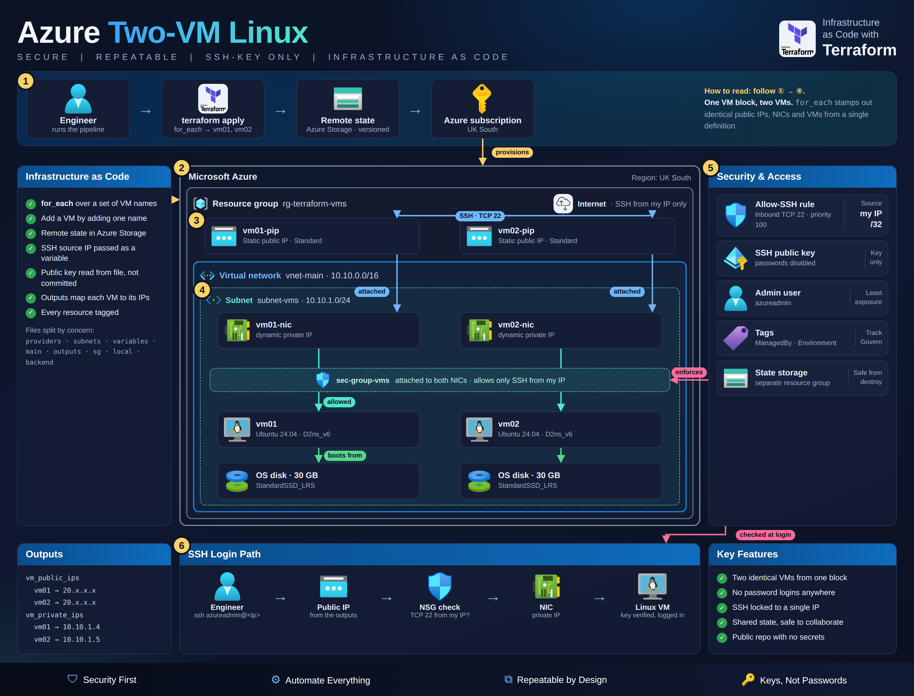

# Terraform Azure VM Provisioner


# Mission Objective

* Build a small, secure Linux environment on Microsoft Azure entirely from code: two Ubuntu servers, their private network, and a firewall.
* Nothing is clicked together in the Azure Portal. One command builds it, one command tears it down.

**In short, this project delivers:**

* Two identical Ubuntu 24.04 servers (`vm01`, `vm02`), created from a single definition
* A private network with a firewall that only lets **my own IP address** log in
* Password-free login using SSH keys
* Terraform state stored securely in Azure Storage instead of on my laptop
* An environment that can be rebuilt or deleted in minutes, which keeps costs under control



# Skills Demonstrated

* **Infrastructure as Code** - Terraform, `for_each` loops, variables, outputs, remote state
* **Azure** - Virtual Machines, Virtual Networks, Network Security Groups, Public IPs, Storage
* **Security** - SSH key authentication, IP-restricted firewall rules, keeping secrets out of source control
* **Troubleshooting** - diagnosing and fixing real deployment errors (see [Challenges & Fixes](#challenges--fixes))
* **Cost awareness** - right-sized VMs and a full teardown when finished

# Checkpoints

1. [Prerequisites](#prerequisites)
2. [Step-1 (Azure Login)](#step-1-azure-login)
3. [Step-2 (Remote State & Variables)](#step-2-remote-state--variables)
4. [Step-3 (Networking)](#step-3-networking)
5. [Step-4 (Virtual Machines)](#step-4-virtual-machines)
6. [Step-5 (Terraform Init)](#step-5-terraform-init)
7. [Step-6 (Terraform Plan)](#step-6-terraform-plan)
8. [Step-7 (Terraform Apply)](#step-7-terraform-apply)
9. [Step-8 (Verification)](#step-8-verification)
10. [Challenges & Fixes](#challenges--fixes)
11. [Deliverables](#deliverables)
12. [Final Step - Teardown](#final-step---teardown)
13. [Author](#author)

# Prerequisites

* Terraform installed (version 1.8 or higher)
* Azure CLI installed
* An active Azure subscription
* An SSH key pair for logging in to the servers
* Patience & lots of coffee

# Step-1 (Azure Login)

The Azure CLI signs in to my Azure account so Terraform has permission to build resources.

* `az login`
* `az account show`

See screenshot below


# Step-2 (Remote State & Variables)

Terraform keeps a record (the "state") of everything it has built. Instead of leaving that file on my laptop, it is stored in a private Azure Storage container. The container sits in its own resource group, so tearing down the servers never deletes it by accident.

```bash
az group create -n rg-tfstate -l uksouth
az storage account create -n <unique-name> -g rg-tfstate -l uksouth --sku Standard_LRS
az storage container create -n tfstate --account-name <unique-name>
```

My IP address and SSH public key go in a `terraform.tfvars` file. This file is git-ignored, so personal details never end up in the repository:

```hcl
my_ip          = "203.0.113.10"
ssh_public_key = "ssh-ed25519 AAAA... you@machine"
```

# Step-3 (Networking)

Before the servers can exist, they need somewhere to live. This step builds that:

* A resource group called `rg-terraform-vms` in the UK South region, which holds everything for this project
* A private virtual network (`10.10.0.0/16`) with a subnet (`10.10.1.0/24`) for the servers
* A firewall (Network Security Group) that allows SSH on port 22 **from my IP address only**
* A static public IP address and a network card for each server

# Step-4 (Virtual Machines)

Two servers, `vm01` and `vm02`, are built from one block of code using a `for_each` loop, so they are identical. Adding a third server only takes adding one more name to the list in `6-local.tf`.

* Ubuntu 24.04 LTS operating system
* `Standard_D2ns_v6` size, which is small and low-cost
* A 30 GB SSD for the operating system
* SSH key login only, with passwords disabled
* Tagged with `Environment = lab` and `ManagedBy = Terraform` so they're easy to track

# Step-5 (Terraform Init)

Downloads the Azure provider and connects Terraform to the remote state storage.

* `terraform init`

See screenshot below


# Step-6 (Terraform Plan)

Previews every change before anything is built. The plan shows 12 resources to add.

* `terraform plan -out=tfplan`

See screenshot below


# Step-7 (Terraform Apply)

Builds everything from the saved plan. All 12 resources are created.

* `terraform apply "tfplan"`

See screenshot below


# Step-8 (Verification)

Terraform prints each server's private and public IP address:

* `terraform output`


Both servers show as Running in the Azure Portal:


Logging in to each server over SSH:

* `ssh azureadmin@<public-ip-from-output>`


# Challenges & Fixes

Real problems I hit along the way and how I solved them.

## 1. Region out of capacity

The original server size (`Standard_B2s`) wasn't available in UK South.

**Fix:** switched to `Standard_D2ns_v6`, which was available in the region.


## 2. Azure subscription not ready

The subscription hadn't enabled Azure's networking service, so Terraform couldn't create the network.

**Fix:** registered the required services (`Microsoft.Network`, `Microsoft.Compute`, `Microsoft.Storage`) with the Azure CLI.


## 3. Firewall was too open

The first version allowed SSH from anywhere on the internet.

**Fix:** locked the rule down to my own IP address, which is passed in as a variable.

## 4. Code errors

A typo left a resource type blank, and a loop referenced a property that didn't exist.

**Fix:** corrected the resource name and fixed the loop to use the server name directly.


# Deliverables

* 12 Azure resources built entirely from code:
  * 1 resource group, `rg-terraform-vms`
  * 1 virtual network and 1 subnet
  * 1 firewall (Network Security Group), plus 2 links attaching it to each server's network card
  * 2 static public IP addresses
  * 2 network cards
  * 2 Ubuntu 24.04 servers, `vm01` and `vm02`
* Terraform outputs listing each server's private and public IP address
* Remote state stored safely in Azure Storage
* SSH access that works from my IP address only

# Final Step - Teardown

Unless you can print your own money, you need to tear down the deployment.

* `terraform destroy`
* Confirm with `yes` when asked.
* Check the Azure Portal to make sure the resource group and its resources are gone.

See screenshot below


# Author

Benjamin Cooper
