# Terraform Azure VM Provisioner


# Mission Objective
* A Terraform project that provisions two Ubuntu 24.04 LTS Linux virtual machines (`vm01`, `vm02`) on Azure, each with its own public IP and NIC, sitting inside a dedicated virtual network / subnet that is protected by a network security group allowing inbound SSH.

# Checkpoints

1. [Prerequisites](#prerequisites)
2. [Step-1 (Azure Authentication)](#step-1-azure-authentication)
3. [Step-2 (Provider Configuration)](#step-2-provider-configuration)
4. [Step-3 (Networking Resources)](#step-3-networking-resources)
5. [Step-4 (Compute Resources)](#step-4-compute-resources)
6. [Step-5 (Terraform Init)](#step-5-terraform-init)
7. [Step-6 (Terraform Plan)](#step-6-terraform-plan)
8. [Step-7 (Terraform Apply)](#step-7-terraform-apply)
9. [Step-8 (Verification)](#step-8-verification)
10. [Errors](#errors)
11. [Deliverables](#deliverables)
12. [Final Step - Teardown](#final-step---teardown)
13. [Author](#author)

# Prerequisites
* Terraform installed (version 1.8.0 or higher)
* Azure CLI installed and authenticated (`az login`)
* An active Azure subscription
* An SSH key pair for VM admin access
* Basic understanding of Azure networking concepts
* Patience & lots of coffee

# Step-1 (Azure Authentication)

Before Terraform can talk to Azure, the CLI needs to be logged in and pointed at the right subscription.

* `az login`
* `az account show`

See screenshot below

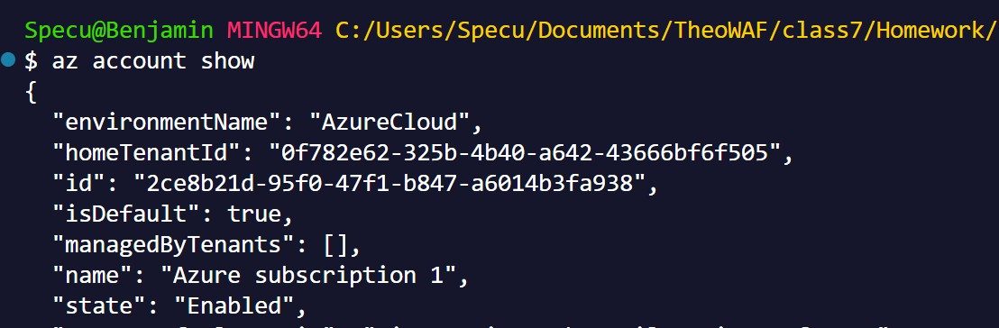

# Step-2 (Provider Configuration)

`0-providers.tf` pins the Terraform version and the `azurerm` provider, then configures the provider block:

```hcl
terraform {
  required_version = ">= 1.8.0"

  required_providers {
    azurerm = {
      source  = "hashicorp/azurerm"
      version = "~> 5.0"
    }
  }
}

provider "azurerm" {
  features {}
}
```

# Step-3 (Networking Resources)

Before the VMs can exist, they need a place to live. This step builds that neighborhood:

* A resource group (a folder that holds everything for this project) in the UK South region
* A private network for the VMs to sit inside, plus a subnet carved out of it
* A firewall rule that only opens the door for SSH, so you can log in remotely
* A public IP address and network card for each VM, so they're reachable from the internet

# Step-4 (Compute Resources)

This is where the actual virtual machines get created - two of them, `vm01` and `vm02`, built from the same template so they're identical twins:

* A modest, low-cost VM size that's plenty for testing
* Ubuntu 24.04 LTS as the operating system
* Login is SSH-key-only - no passwords, so only someone with your private key can get in
* A 30 GB disk for the operating system

# Step-5 (Terraform Init)

Input the following command in the terminal panel (PowerShell/Bash).
* `terraform init`

See screenshot below

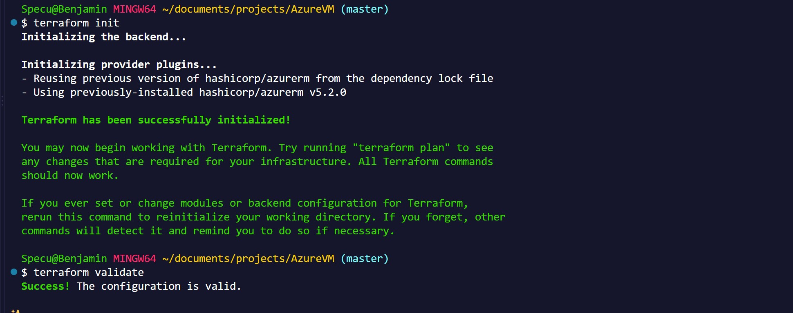

# Step-6 (Terraform Plan)

Input the following command in the terminal panel.
* `terraform plan -out=tfplan`

See screenshot below

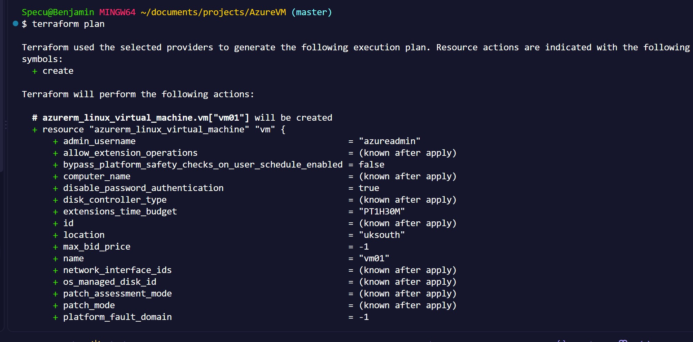

# Step-7 (Terraform Apply)

Input the following command in the terminal panel.
* `terraform apply "tfplan"`

See screenshot below

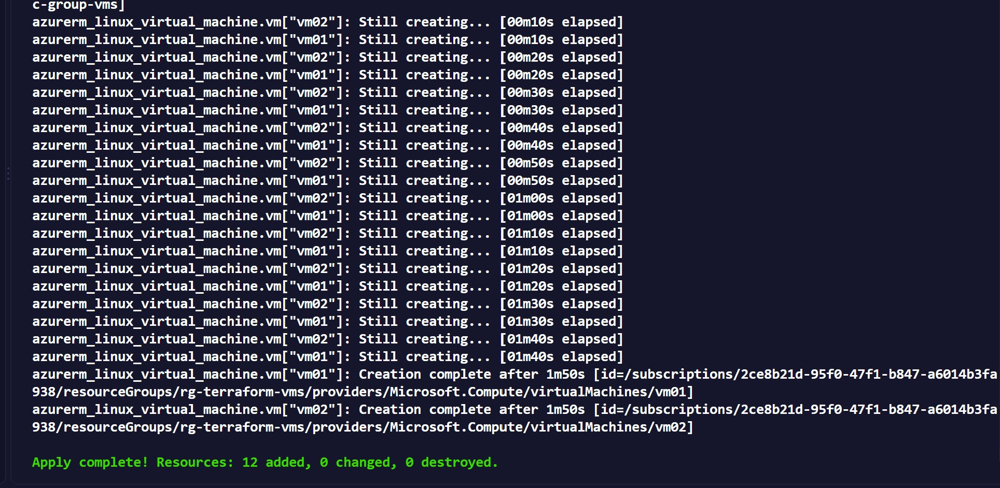

# Step-8 (Verification)

Confirm the VMs actually came up in Azure, and check the Terraform outputs for the assigned IPs.

* `az vm list -g rg-terraform-vms -d -o table`
* `terraform output`

See screenshots below

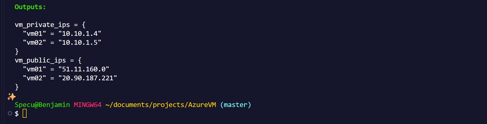

VM confirmation
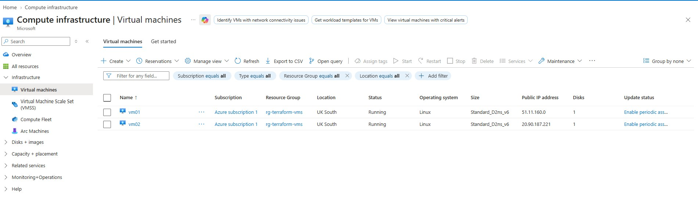

Azure VM01 connect
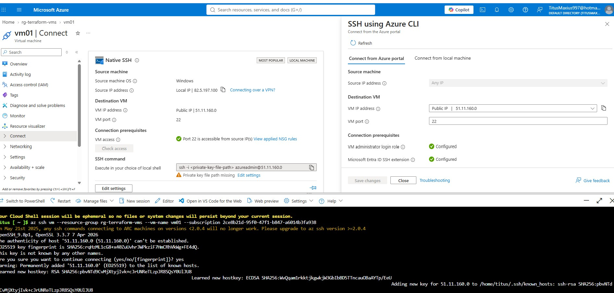

Azure VM02 connect
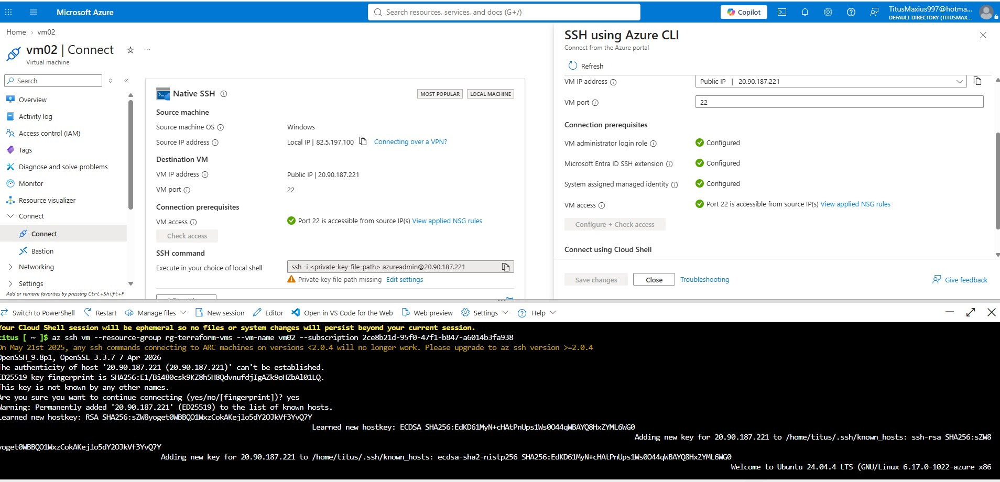

# Errors

A few bumps along the way, kept here for the next person who hits the same wall.

**Invalid resource type name** - a typo left the resource type blank in `3-main.tf`.

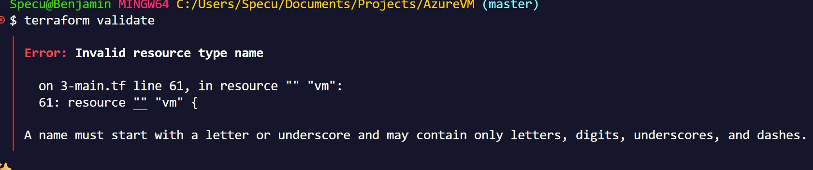

**Unsupported attribute** - `local.vm_names` is a `toset()` of plain strings, so `each.value` is a string, not an object; `each.value.id` doesn't exist. Fixed by using `each.key` / `each.value` directly as the string.

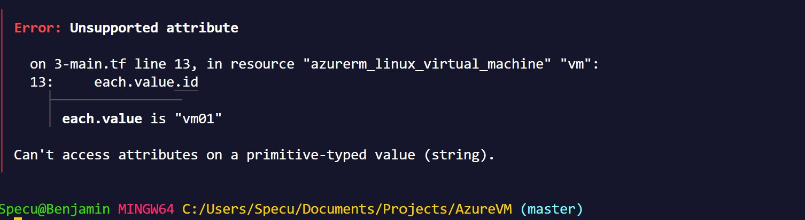

**Provider not registered** - the subscription hadn't registered the `Microsoft.Network` resource provider yet.

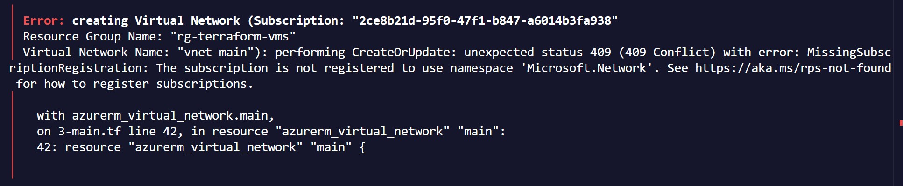

Resolved by registering it (and the other providers this project needs) and polling until `"Registered"`:

* `az provider register --namespace Microsoft.Network`

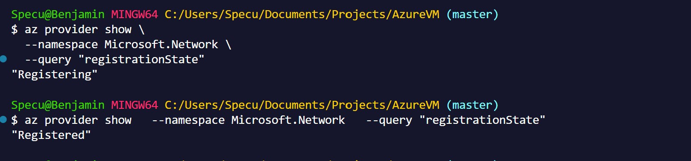


**SKU not available in region** - the original VM size `Standard_B2s` had no capacity in `uksouth`.

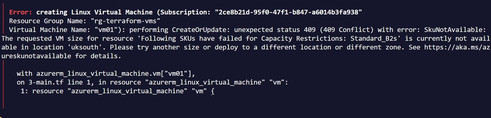

Resolved by switching the VM `size` to `Standard_D2ns_v6`, which had capacity in the region.

# Deliverables
* Congrats, you have successfully deployed two Azure Linux VMs with Terraform and you are now ready for more pain.
Collect screenshots for your records.

* Resource group `rg-terraform-vms` containing a VNet, subnet, NSG, and two VMs (`vm01`, `vm02`) each with a static public IP.
* `terraform output` showing the private and public IPs of both VMs.

# Final Step - Teardown
Unless you can print your own money, you will need to tear down your deployment.
   * Input `terraform destroy -auto-approve` in your terminal.
   * You will be asked to confirm deletion (unless `-auto-approve` is used) - say yes.
   * Double check the Azure Portal/CLI that the resource group and its resources are gone.
   * Triple check everything - Satya Nadella has enough money too.

See screenshot below

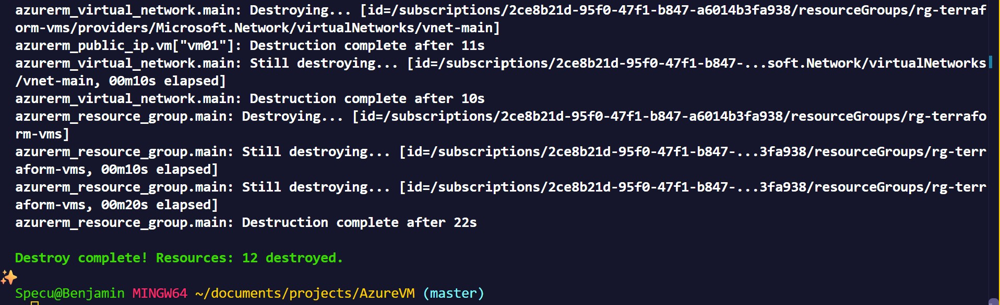

# Author
Benjamin Cooper
